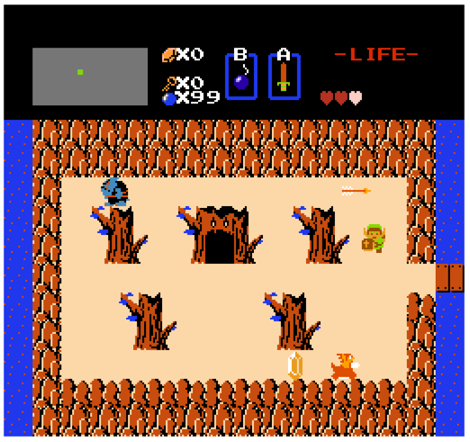

# ZeldaJS - A Legend of Zelda clone in TypeScript


[](https://codecov.io/gh/bobbylight/ZeldaJS)

A WIP clone of the Legend of Zelda.  This will include a very basic editor as well.
Feel free to [try it out in its current state](http://bobbylight.github.io/ZeldaJS/).



Licensed under [an MIT license](LICENSE.txt).

## Hacking
First, check out the project and install all dependencies locally via `npm`:

```bash
git clone https://github.com/bobbylight/ZeldaJS.git
cd ZeldaJS
nvm use
npm install
```

To get started right away, run:

```bash
npm run dev
```

The game will be served from [http://localhost:5173](), and hot deploy any changes.

This game is built with [vite](https://vite.dev/).  Development is done with `npm` scripts:

```bash
npm run clean          # Cleans build directories
npm run dev            # Runs app for development. Hot deploys with changes
npm run build          # Builds for production in dist/
npm run serve          # Serves the production build locally
npm run test           # Runs unit tests and generates coverage
npm run lint           # Lints files
npm run lint:fix       # Lints files and fixes errors
npm run tsc            # Runs type check via tsc
npm run doc            # Generates documentation
```

The source code lives in `src/`, and is built into `dist/`.
`index.html` is the game itself, while `editor.html` is a simple map editor.

## Desktop Build
*Note:* These steps currently don't work.  Need to be fixed after the conversion
to vue-cli broke them.

A desktop build can be created:

```bash
npm run build-electron # Builds desktop resources into build/electron
npm run pack           # Creates unpacked game in dist/
npm run dist           # Creates unpacked game and installer in dist/
```

This is still a little rough around the edges, but works, at least on windows.

## Roadmap
I'm going to try to use the [issue tracker](https://github.com/bobbylight/ZeldaJS/issues) to track the work on this project.

### Implemented so far:

* Game
  - Map loading
  - Basic resource loading, Link sprite movement
  - Music
  - Moving between screens, smooth screen transitions (though only a portion of the map is implemented)
  - Entering and exiting caves
  - Use of sword (Z key)
  - Drop bombs, though they do nothing (X key)
  - Basic enemies that can die
  - Link takes damage from enemies and projectiles, and can die
  - Enemies drop rupees and hearts
* Editor
  - Screen design, single tile per cell (no burnable bushes, bombable walls, etc.)
  - Assign enemies to screens
  - Enter and exit cave and level events
